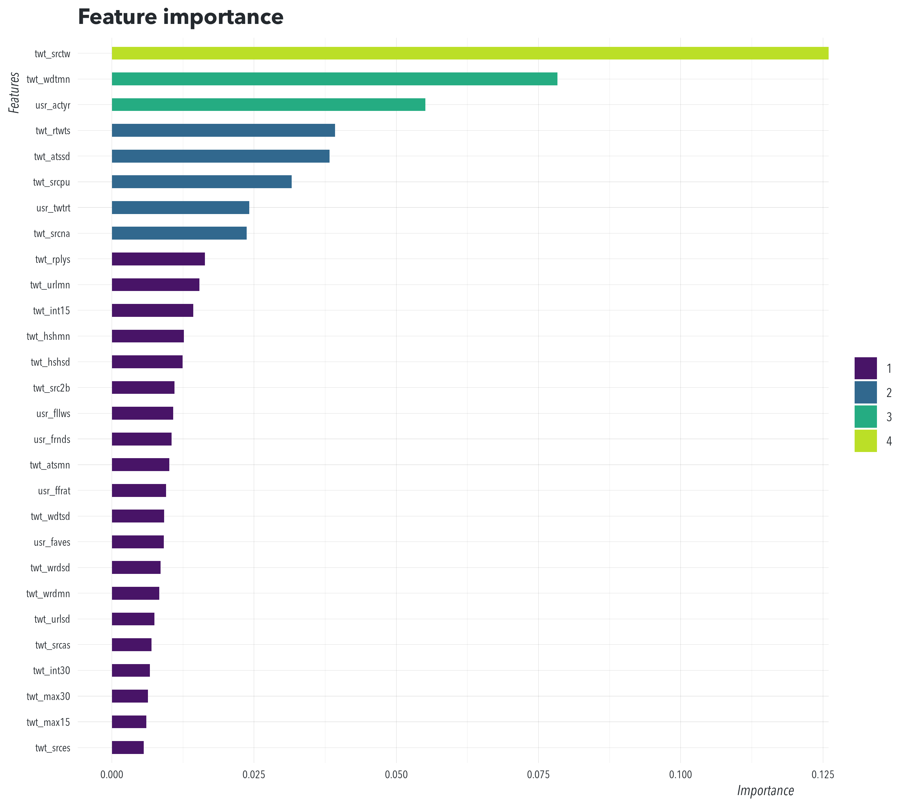

<!-- README.md is generated from README.Rmd. Please edit that file -->

```{r, include = FALSE}
knitr::opts_chunk$set(
  collapse = TRUE,
  comment = "#>",
  fig.path = "man/figures/README-",
  out.width = "100%",
  cache = TRUE
)
options(width = 90, digits = 5, scipen = 6,
  datatable.print.topn = 5, datatable.print.nrows = 50)
library(tweetbotornot2)
version <- as.vector(read.dcf('DESCRIPTION')[, 'Version'])
version <- gsub('-', '.', version)
```

# tweetbotornot2 

<!-- badges: start -->
[](https://travis-ci.org/mkearney/tweetbotornot2)
[](https://CRAN.R-project.org/package=tweetbotornot2)
[](https://www.tidyverse.org/lifecycle/#experimental)
[](https://codecov.io/gh/mkearney/tweetbotornot2?branch=master)
[](https://ci.appveyor.com/project/mkearney/tweetbotornot2)
[](https://cran.r-project.org/package=tweetbotornot2)
[](https://github.com/mkearney/tweetbotornot2)
[](https://github.com/mkearney/tweetbotornot2/fork)
[)`-yellowgreen.svg)](/commits/master)
[](commits/master)
[](https://choosealicense.com/)
[](https://github.com/mkearney/tweetbotornot2)


<!-- badges: end -->

**`{tweetbotornot2}`** provides an out-of-the-box classifier for detecting Twitter
bots that is [easy to use](#predict), [interpretable](#explain), 
[scalable](#rate-limits), and [performant](#about-model). It also provides a
[convenient interface](#botometer) for accessing the **`botometer`** API.

## Installation

<!-- Install the released version of tweetbotornot2 from [CRAN](https://CRAN.R-project.org) with: -->

<!-- ``` r -->
<!-- ## install from CRAN -->
<!-- install.packages("tweetbotornot2") -->
<!-- ``` -->

Install the development version of `{tweetbotornot2}` from [Github](https://github.com) with:

``` r
## install {remotes} if not already
if (!"remotes" %in% installed.packages()) {
  install.packages("remotes")
}

## install from github
remotes::install_github("mkearney/tweetbotornot2")
```

## Predict

### Use `predict_bot()` to run the built-in bot classifier

Provide a vector or data frame of Twitter handles and `predict_bot()` will
return the estimated probability of each account being a bot.

```{r}
## vector of screen names
screen_names <- c(
  "American__Voter", ## (these ones should be bots)
  "MagicRealismBot",
  "netflix_bot",
  "mitchhedbot",
  "rstats4ds",
  "thinkpiecebot",
  "tidyversetweets",
  "newstarsbot",
  "CRANberriesFeed",
  "AOC",             ## (these ones should NOT be bots)
  "realDonaldTrump",
  "NateSilver538",
  "ChadPergram",
  "kumailn",
  "mindykaling",
  "hspter",
  "rdpeng",
  "kearneymw",
  "dfreelon",
  "AmeliaMN",
  "winston_chang"
)

## data frame with screen names **must be named 'screen_name'**
screen_names_df <- data.frame(screen_name = screen_names)

## vector -> bot estimates
predict_bot(screen_names)

## data.frame -> bot estimates
#predict_bot(screen_names_df)
```

This also works on Twitter user IDs.

``` r
## vector of user IDs (strings of numbers, ranging from 2-19 digits)
user_ids <- rtweet::lookup_users(screen_names)[["user_id"]]

## data frame with user IDs **must be named 'user_id'**
user_ids_df <- data.frame(user_id = users)

## vector -> bot estimates
predict_bot(user_ids)

## data.frame -> bot estimates
predict_bot(user_ids_df)
```

The input given to `predict_bot()` can also be Twitter data returned by 
[{rtweet}](https://rtweet.info), i.e., `rtweet::get_timelines()`<sup>1</sup>.

```{r}
## timeline data returned by {rtweet}
twtdat <- rtweet::get_timelines(screen_names, n = 200, check = FALSE)

## generate predictions from twitter data frame
predict_bot(twtdat)
```

## Explain

### Use `explain_bot()` to see the contributions made by each feature

View prediction contributions from top five features (for each user) in the model

```{r}
## view top feature contributions in prediction for each user
explain_bot(twtdat)[
  order(screen_name, 
  -abs(value)), ][
    feature %in% feature[1:5],
    .SD, on = "feature" ][1:50, -1]
```

## Rate limits

If you have already collected user timeline data, `predict_bot()` has no rate 
limit. If you don't already have timeline data, then `predict_bot()` relies on 
calls to Twitter's `users/timeline` API, which is rate limited to 1,500 calls 
per 15 minutes (for bearer tokens) or 900 calls per 15 minutes (for user tokens).
Fortunately, each prediction requires only one call to Twitter's API, so it's 
possible to get up to 6,000 predictions per hour or 144,000 predictions per 
day<sup>2</sup>.

```{r}
## view bearer token rate limit for users/timeline endpoint
rtweet::rate_limit(rtweet::bearer_token(), "get_timeline")

## view user token rate limit for users/timeline endpoint
rtweet::rate_limit(rtweet::get_token(), "get_timeline")
```

## About Model

### Feature importance

The most influential features in the classifier

```{r, include=FALSE, eval=FALSE}
# idsbot <- c("user_id", "screen_name", "bot")
# xgboost::xgb.ggplot.importance(xgboost::xgb.importance(
#   model = tweetbotornot2:::tweetbotornot_xgb_model,
#   trees = 1:1000), measure = "Gain", top_n = 28) +
#   ggplot2::scale_fill_viridis_d(begin= 0.05, end = 0.9) +
#   dataviz::theme_mwk(12, "Avenir Next LT Pro") +
#   #ggplot2::coord_cartesian(ylim = c(0, 0.3)) +
#   #ggplot2::coord_flip(ylim = c(0, .12)) +
#   ggplot2::ggsave("man/figures/README-import.png", width = 9, height = 8,
#     units = "in", dpi = 312)
```



### Feature contributions

How features contributed to predictions in the original training data:

```{r, include=FALSE, eval=FALSE}
# .d <- tfse::read_RDS("../twbt/data-final-munged.rds")
# 
# png("man/figures/README-shap.png", width = 9, height = 8, units = "in", res = 312)
# par(tcl = -0.175, bty = "n", xaxt = "s", yaxt = "s", col = "#aaaaaa")
# cols <- viridis::viridis_pal(begin = 0.1, end = 0.9)(2)
# suppressWarnings(
#   xgboost::xgb.plot.shap(
#     data = as.matrix(.d[, -(1:3)]),
#     trees = 1:150,
#     model = tweetbotornot2:::tweetbotornot_xgb_model,
#     top_n = 36, n_col = 6,
#     discrete_jitter = 0.15, span_loess = 0.35, col_loess = cols[1],
#     col = cols[2],
#     family = "Avenir Next LT Pro",
#     cex.lab = 1.5,
#     ylab = NA
#   )
# )
# dev.off()
```


## Botometer

### Use `predict_botometer()` to access [Botometer's API](https://botometer.iuni.iu.edu)

```{r}
## get botometer scores
predict_botometer(c('kearneymw', 'netflix_bot'))
```


### Botometer vs tweetbotornot2

Accuracy of tweetbotornot versus botometer across multiple datasets:


<sup>1</sup> The built-in classifier was trained using [up to] the most recent 200
tweets from each user. That means all tweets older than the 200th tweet will be
filtered out (ignored). It also means that estimates made on fewer than the most
recent 200 tweets are unreliable–except in cases where a user doesn't HAVE up to
200 eligible tweets. In other words, the classifier should work as expected if
data are gathered via {rtweet}'s `get_timeline()` function with the `n` argument
set equal to or greater than 200, i.e. `rtweet::get_timelines(users, n = 200)`.

<sup>2</sup> This is in contrast to [botometer](https://botometer.iuni.iu.edu/), 
which recently increased its rate limit to 2,000 calls *per day* (up from 1,000 
calls per day).
